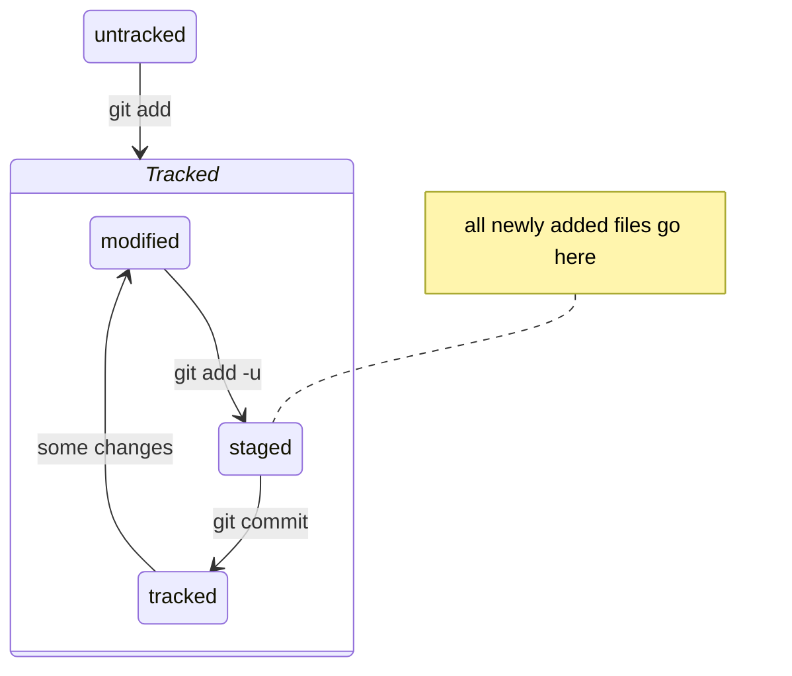

# HELLO MY DEAR FRIEND!!!

Hopr you're excited to learn about GIT cause that's what we're gonna do here.

## BUT WHAT IS GIT??

Wouldn't you like to know! Git is a VCS (version control system) created by none other than [Linus Torwalds](https://en.wikipedia.org/wiki/Linus_Torvalds "Linus!"). Why is it called "git"? According to Linus himself, it can mean, depending on your mood:

- random three-letter combination that is pronounceable, and not actually used by any common UNIX command. The fact that it is a mispronunciation of "get" may or may not be relevant.

- stupid. contemptible and despicable. simple. Take your pick from the dictionary of slang.

- "global information tracker": you're in a good mood, and it actually works for you. Angels sing, and a light suddenly fills the room.

- "goddamn idiotic truckload of sh*t": when it breaks.


## COOL, AND WHAT DOES IT DO?

Oh, what doesn't it do, dear friend of mine! It lets you `add` (*two and two together, and even more*), `commit` (*fortunately not crimes*), `push` (*sometimes even boundaries*) and `pull` (*but not punches*).

Here's what it all looks like:

```bash
git add
git commit
git push
git pull
```

Now wasn't that comprehensive!

## NO IT WASN'T COMPREHENSIVE HOW DO I DO STUFF IN GIT AHHH

Whoa, whoa, don't worry, it's actually pretty easy! Let's break it down.

### File states

All the files in git repository are either `tracked` or `untracked`. The `untracked` ones are simply the ones you either don't want to include in repository or have not included just yet. And the `tracked` ones can be either up to date, `modified` – if they have changes that have not been yet added, or `staged` – if they have changes that have been added but not commited yet.<br>
The loop usually goes like this:

About that `git add -u` thingie: it lets you automatically stage all modified tracked files without adding untracked ones. Pretty cool huh??

## HOW NOT TO GET LOST

Eventually there'll be a whole lot of commits – "but how do I diffirentiate them", you ask? Why, it's easy!<br>
Firstly, every commit has a unique SHA-1 hash, and you can adress the commit by that hash any time. Secondly, each commit should have a comprehensive commit message (and you should leave these messages too when commiting!).<br>Hashes and messages are visible on `git log`, but the entirety of `git log` gets pretty lengthy – so you can either use `git log --oneline` to ouput shortened versions of log messages, or, if you need to find out who screwed up your favourite file – use `git blame <my-favourite-file>`!